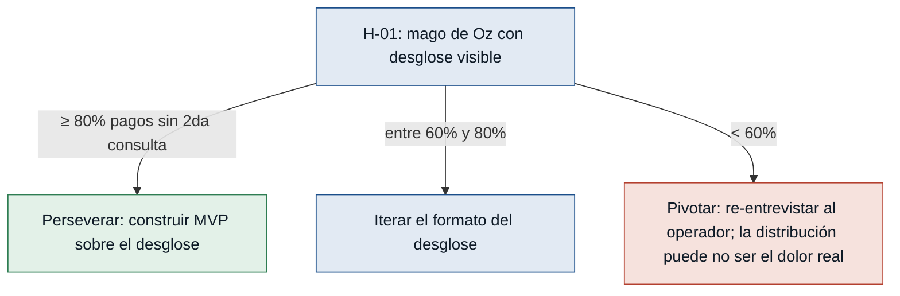

# Hipótesis y experimentos — fondo-cesantia

> Cinco hipótesis extraídas de los supuestos más riesgosos del MVP Canvas
> (`mvp-canvas.md`), ordenadas de mayor a menor riesgo. Cada una es falsable:
> incluye señal medible de negocio, criterio de éxito con número, experimento
> del tipo más barato que responda, caja de tiempo/costo y regla de decisión
> para el caso de pasar **y de fallar**.

## Mapa de decisiones del experimento más riesgoso

---

### [H-01] El desglose visible de la distribución cambia el comportamiento del operador — riesgo: alto
- **Supuesto a probar:** si el operador ve de inmediato cómo se distribuyó el pago, valida la operación sin tener que revisar el historial manualmente.
- **Hipótesis:** Creemos que el Operador de pagos dejará de revisar el historial manualmente para validar la distribución de un pago si el sistema le muestra de forma clara y visible cómo se aplicó el dinero, porque hoy su mayor carga cognitiva es reconstruir esa distribución a mano.
- **Señal medible:** tasa de pagos registrados que **no requieren una segunda consulta al historial** por parte del operador en los 30 minutos siguientes (proxy directo del outcome declarado en el canvas).
- **Criterio de éxito:** ≥ 80% de los pagos en una muestra de al menos 50 pagos reales no requieren segunda consulta al historial, medido en 2 semanas de operación asistida.
- **Experimento:** mago de Oz / concierge — instrumentar el módulo real para que muestre el desglose de distribución y medir cuántas veces el operador abre después el historial del préstamo; comparar contra la línea base actual (operador sin desglose visible).
- **Caja de tiempo/costo:** 2 semanas de operación asistida; ~8 horas/semana de un observador.
- **Regla de decisión:** Si pasa (≥ 80%) → perseverar y construir el módulo completo sobre esa base. Si falla (< 60%) → pivotar: el dolor real del operador puede no ser la distribución visible; re-entrevistar para entender qué información falta. Si queda entre 60% y 80% → iterar sobre el formato del desglose antes de comprometer más desarrollo.

---

### [H-02] El comprobante inmediato reduce los reclamos por "pago no reflejado" — riesgo: alto
- **Supuesto a probar:** si el cliente ve al instante un comprobante con el efecto del pago sobre su deuda, deja de reclamar por pagos no reflejados.
- **Hipótesis:** Creemos que el Cliente del préstamo dejará de reclamar por pagos "no reflejados" si ve en el momento un comprobante con monto aplicado, cuotas cubiertas y saldo pendiente actualizado, porque el dolor declarado es la incertidumbre sobre si el pago quedó bien registrado.
- **Señal medible:** tasa de reclamos por "pago no reflejado" en los 7 días posteriores al pago (call center + WhatsApp + presencial), normalizada por cada 100 pagos registrados.
- **Criterio de éxito:** reducción ≥ 50% respecto a la línea base medida en el mes previo al MVP, sostenida durante 4 semanas consecutivas.
- **Experimento:** fake door + smoke test — publicar en la app/web del cliente una pantalla de "comprobante de pago" (incluso alimentada a mano al inicio con datos reales capturados por el operador) y medir cuántos clientes la consultan; comparar la tasa de reclamos antes y después de habilitarla.
- **Caja de tiempo/costo:** 4 semanas de medición; una pantalla estática (~1 sprint) + ~4 horas/semana de un agente de call center para clasificar reclamos.
- **Regla de decisión:** Si pasa (≥ 50% de reducción) → construir el comprobante automático dentro del MVP. Si falla (< 25% de reducción) → pivotar: el dolor real puede ser la demora de actualización, no la falta de comprobante; experimentar con notificación push inmediata. Si queda entre 25% y 50% → iterar el formato del comprobante y volver a medir.

---

### [H-03] La trazabilidad auditable acorta la investigación de inconsistencias — riesgo: medio
- **Supuesto a probar:** si el supervisor reconstruye cualquier movimiento desde el propio sistema, resuelve las inconsistencias sin pedir reportes externos.
- **Hipótesis:** Creemos que el Supervisor de pagos reducirá el tiempo medio de investigación de inconsistencias si accede desde el sistema al historial auditable completo del pago, porque hoy debe cruzar fuentes para reconstruir lo ocurrido.
- **Señal medible:** tiempo medio (en minutos) desde que se abre un caso de inconsistencia hasta que el supervisor identifica la causa raíz.
- **Criterio de éxito:** reducción ≥ 40% respecto a la línea base, en al menos 10 casos reales investigados durante 4 semanas.
- **Experimento:** concierge — dar al supervisor una vista "wizard" que reconstruye el movimiento a partir de los logs reales (sin nuevo desarrollo), medir tiempos reales y compararlos con su flujo actual; al final, entrevistarlo sobre la información que faltó o sobró.
- **Caja de tiempo/costo:** 4 semanas de operación asistida; construcción de la vista concierge (~1 sprint) + ~3 horas/semana del supervisor.
- **Regla de decisión:** Si pasa (≥ 40% de reducción) → construir la vista de trazabilidad dentro del MVP. Si falla (< 20% de reducción) → pivotar: el cuello de botella puede estar en otra capa (conciliación contable), no en la trazabilidad; abrir discovery específico. Si queda entre 20% y 40% → iterar qué campos del historial se exponen.

---

### [H-04] Los blindajes eliminan la clase de defectos recurrentes del QA — riesgo: medio
- **Supuesto a probar:** si el sistema bloquea pagos sobre préstamos cancelados, previene duplicados y permite reverso con motivo, se elimina la clase de defectos que el QA viene reportando.
- **Hipótesis:** Creemos que el Especialista QA dejará de reportar defectos por pagos duplicados, pagos sobre préstamos cancelados y errores sin reversa posible si el sistema aplica blindajes en esos tres puntos, porque son los escenarios donde históricamente más se han colado errores.
- **Señal medible:** número de defectos abiertos en QA por esos tres escenarios en un ciclo de liberación.
- **Criterio de éxito:** 0 defectos críticos y ≤ 2 defectos menores por escenario, sostenidos durante 3 ciclos consecutivos de liberación.
- **Experimento:** prototipo evolutivo — implementar los tres blindajes como capa fina sobre el módulo actual y correr la suite de QA más un set de pruebas de caos (doble clic, dos sesiones simultáneas, intento sobre cancelado) durante los siguientes 3 ciclos de liberación.
- **Caja de tiempo/costo:** 3 ciclos de liberación (≈ 6–9 semanas); implementación de los 3 blindajes (~2 sprints) + ~6 horas/semana de QA.
- **Regla de decisión:** Si pasa (0 críticos, ≤ 2 menores por escenario en 3 ciclos) → promover los blindajes a parte estable del MVP. Si falla (≥ 1 crítico por escenario en 2 ciclos seguidos) → pivotar: los blindajes pueden estar en la capa equivocada (solo UI en lugar de dominio); considerar mover las reglas a una máquina de estados explícita del préstamo. Si queda entre ambos → endurecer las pruebas antes de promover.

---

### [H-05] La suite mínima de 7 escenarios basta para validar cada liberación — riesgo: bajo
- **Supuesto a probar:** si la suite cubre los siete escenarios críticos que QA ya nombra, cada liberación queda validada en los puntos donde más han fallado históricamente.
- **Hipótesis:** Creemos que el Especialista QA podrá validar cualquier cambio del módulo con confianza si la suite cubre, como mínimo, los siete escenarios críticos que ya conoce, porque son los casos donde la historia de defectos es más densa.
- **Señal medible:** porcentaje de ciclos de liberación en los que QA detecta un defecto nuevo (no regresión) en los 30 días posteriores al cambio.
- **Criterio de éxito:** ≤ 10% de ciclos con defectos nuevos post-liberación, medido en al menos 5 ciclos.
- **Experimento:** prototipo evolutivo — construir la suite mínima, correrla sobre los últimos 3 ciclos reales del módulo (replay) y comparar los defectos que habría atrapado con los que efectivamente llegaron a producción.
- **Caja de tiempo/costo:** 5 ciclos de liberación (≈ 10–15 semanas); construcción de la suite (~1 sprint) + ~4 horas/semana de QA.
- **Regla de decisión:** Si pasa (≤ 10% de ciclos con defectos nuevos) → la suite pasa a ser parte del gate de CI del MVP. Si falla (> 25%) → pivotar: la suite no está atacando los escenarios donde realmente se cuelan defectos; revisar con QA qué casos faltaron y reescribirla. Si queda entre ambos → ampliar la suite antes de cerrar.
