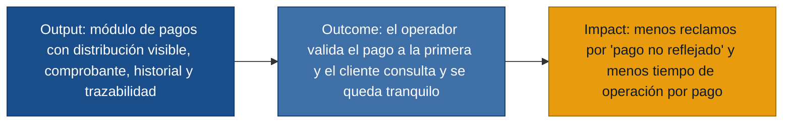

# MVP Canvas — fondo-cesantia

> Producto: **Módulo de aplicación de pagos del fondo de cesantía** (MVP).
> Canvas generado a partir de `personas.md`, `requisitos.md` y `user-stories.md`.

## MVP Canvas

| Bloque | Contenido |
|---|---|
| Propuesta de valor | Cuando un cliente paga su préstamo, el operador registra el pago y, de inmediato, **tanto el operador como el cliente ven con claridad cómo se distribuyó el dinero** (cuotas cubiertas, saldos pendientes, saldo a favor), con un comprobante verificable y un historial trazable. |
| Segmento de usuarios | Clientes del préstamo que pagan y Operadores de pagos que registran el pago. Supervisor y Especialista QA se incluyen como usuarios secundarios (validación y bloqueo de calidad). |
| Funcionalidades mínimas | Registro de pago con distribución automática por antigüedad (US-01, US-02). Comprobante inmediato para el cliente (US-03). Historial legible para el cliente y trazabilidad del saldo a favor (US-04, US-05). Trazabilidad auditable para el supervisor (US-06). Blindajes: bloqueo de pagos en préstamos cancelados (US-07), prevención de duplicados por reintento y concurrencia (US-08), reverso con motivo y trazabilidad (US-09) y suite de pruebas mínimas (US-10). |
| Resultado esperado (outcome) | El operador registra un pago y **lo da por bueno en la primera vista**, sin tener que reconstruir la distribución a mano; el cliente, tras pagar, **consulta su comprobante y se queda tranquilo** porque ve el efecto del pago sobre su deuda. |
| Métrica de éxito | **Tasa de pagos registrados sin necesidad de revisión manual del operador.** Si esta tasa sube, el negocio puede decidir relajar validaciones secundarias y reducir tiempos de caja. **Complemento:** *tasa de reclamos por "pago no reflejado"* en los 7 días posteriores al pago (debe caer a la mitad de la línea base medida antes del MVP). |
| Riesgos / supuestos | (1) Las reglas especiales de refinanciamiento, reestructuración, mora y convenios no están documentadas y aún no entran al MVP. (2) La integración con canales de pago externos (transferencia, débito) está fuera de alcance; el MVP cubre el registro desde el front del operador. (3) La trazabilidad histórica completa del saldo a favor depende de poder migrar el historial previo; si la migración falla, se empezará con saldo a favor desde cero. |
| Fuera de alcance (por ahora) | Reglas especiales por convenio, refinanciamiento o reestructuración (US-11); integración con canales de pago distintos al registro por operador (US-12); reportes gerenciales y tableros de cartera/cobranza/contabilidad (US-13); automatizaciones de cobranza; app móvil para el cliente. |

## Puente output → outcome → impact

## Cobertura de historias por historia de usuario

| Persona | Historias núcleo | Historias endurecimiento |
|---|---|---|
| Cliente del préstamo | US-03, US-04 | — |
| Operador de pagos | US-01, US-02, US-05 | US-08, US-09 |
| Supervisor de pagos | US-06 | US-09 |
| Especialista QA | — | US-07, US-09, US-10 |

## Requisitos cubiertos por el MVP

Cubre: **R-01, R-02, R-03, R-04, R-05, R-06, R-07, R-08, R-09, R-10, R-11 (consistencia inmediata), R-12 (trazabilidad), R-13 (rapidez de actualización), R-14 (claridad), R-15 (cobertura de pruebas mínima)**.

Quedan explícitamente fuera: R-11 en su dimensión de tableros gerenciales (US-13) y la cobertura de reglas especiales (US-11).
