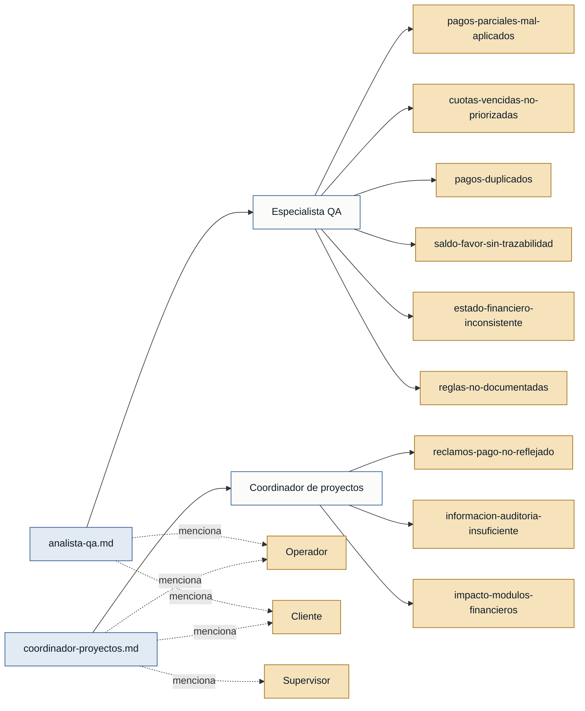

# Personas — fondo-cesantia

> Personas y stakeholders identificados a partir de la evidencia de
> `interviews/`. Toda afirmación cita su fuente. Las personas con respaldo
> `referenciada` no tienen entrevista propia y **no pueden sustentar el MVP**
> hasta contar con entrevista de primera mano.

## Mapa de trazabilidad (entrevistas → personas → dolores)

---

## Personas (con respaldo de primera mano)

### Especialista QA — analista QA
- **Contexto:** Encargado de validar el módulo de aplicación de pagos a
  préstamos; ejecuta pruebas funcionales y de regresión antes de cada cambio.
- **Objetivo principal:** Garantizar que el proceso de registro y aplicación
  de pagos sea consistente, trazable y libre de defectos antes de cada
  liberación.
- **Dolores:**
  - Pagos parciales aplicados de forma incorrecta (analista-qa.md).
  - Cuota incorrectamente marcada como pagada por desarrolladores que
    asumen "cuota actual" (analista-qa.md).
  - Pagos duplicados por doble clic o concurrencia (analista-qa.md).
  - Saldo a favor sin trazabilidad de origen, uso y remanente (analista-qa.md).
  - Riesgo de estado financiero inconsistente para el cliente (analista-qa.md).
  - Reglas especiales (mora, refinanciamiento, reestructuración) no
    documentadas (analista-qa.md).
- **Respaldo:** `primera mano` (analista-qa.md, `primera_persona: true`).

### Coordinador de proyectos — coordinación / negocio
- **Contexto:** Responsable de que el módulo de pagos cumpla la política
  financiera de la organización y se conecte correctamente con cartera,
  cobranza, contabilidad y reportes.
- **Objetivo principal:** Asegurar que cada pago recupere correctamente la
  deuda del cliente y mantenga la información financiera íntegra para
  auditoría y toma de decisiones.
- **Dolores:**
  - Reclamos de clientes cuando un pago no se refleja o el saldo pendiente
    no coincide con los comprobantes (coordinador-proyectos.md).
  - Trazabilidad insuficiente para responder consultas de meses posteriores
    (coordinador-proyectos.md).
  - Impacto colateral del módulo de pagos sobre cartera, cobranza,
    contabilidad y reportes financieros (coordinador-proyectos.md).
- **Respaldo:** `primera mano` (coordinador-proyectos.md, `primera_persona: true`).

---

## Personas referenciadas (mencionadas pero sin entrevista propia)

> Regla de cero invención: estas personas aparecen mencionadas por las
> entrevistas existentes, pero **no tienen entrevista de primera mano**. Se
> incluyen para no perder la pista, pero **no pueden sustentar el MVP** hasta
> conseguir su entrevista.

### Operador
- **Contexto:** Mencionado por ambos entrevistados como quien registra el
  pago en el sistema y dispara la aplicación de cuotas.
- **Objetivo principal:** Registrar el pago del cliente de forma rápida y sin
  duplicarlo, dejando el estado del préstamo consistente.
- **Dolores referenciados:**
  - Lentitud del sistema que lo lleva a presionar "guardar" varias veces
    (analista-qa.md).
  - Riesgo de trabajar simultáneamente con otro usuario sobre el mismo
    préstamo (analista-qa.md).
- **Respaldo:** `referenciada` (mencionada en analista-qa.md y
  coordinador-proyectos.md; sin entrevista propia).

### Cliente
- **Contexto:** Persona que realiza pagos sobre su préstamo y reclama cuando
  el sistema no refleja su pago.
- **Objetivo principal:** Ver que su pago quede aplicado correctamente y que
  su saldo pendiente se reduzca de forma consistente.
- **Dolores referenciados:**
  - Pago realizado pero no reflejado en el sistema
    (coordinador-proyectos.md).
  - Cuotas vencidas que siguen apareciendo pese a haber pagado
    (coordinador-proyectos.md).
- **Respaldo:** `referenciada` (mencionada en coordinador-proyectos.md;
  sin entrevista propia).

### Supervisor
- **Contexto:** Mencionado por el coordinador como quien autoriza procesos
  excepcionales sobre préstamos (reversos, reestructuraciones, convenios).
- **Objetivo principal:** Autorizar manualmente procesos fuera del flujo
  estándar manteniendo la trazabilidad de la decisión.
- **Dolores referenciados:**
  - Procesos manuales autorizados que deben convivir con la lógica estándar
    (coordinador-proyectos.md).
- **Respaldo:** `referenciada` (mencionada en coordinador-proyectos.md;
  sin entrevista propia).

---

## Stakeholders

### Coordinación / negocio (cartera, cobranza, contabilidad, reportes)
- **Interés en el sistema:** Que cada pago mantenga la deuda real del
  cliente y la integridad de los indicadores financieros de la organización;
  cualquier cambio en el módulo de pagos debe evaluarse por impacto.
- **Fuente:** coordinador-proyectos.md.

### Equipo de QA
- **Interés en el sistema:** Trazabilidad completa de pagos, cuotas afectadas,
  montos aplicados y reversos; poder validar pagos exactos, parciales,
  excedentes, saldo a favor, reversos y casos extremos sin acceder a la BD.
- **Fuente:** analista-qa.md.

### Supervisión (actor de autorización)
- **Interés en el sistema:** Poder autorizar procesos excepcionales
  (reversos, refinanciamientos, reestructuraciones, convenios) con un
  registro claro de quién autorizó qué y cuándo.
- **Fuente:** coordinador-proyectos.md (referenciado).