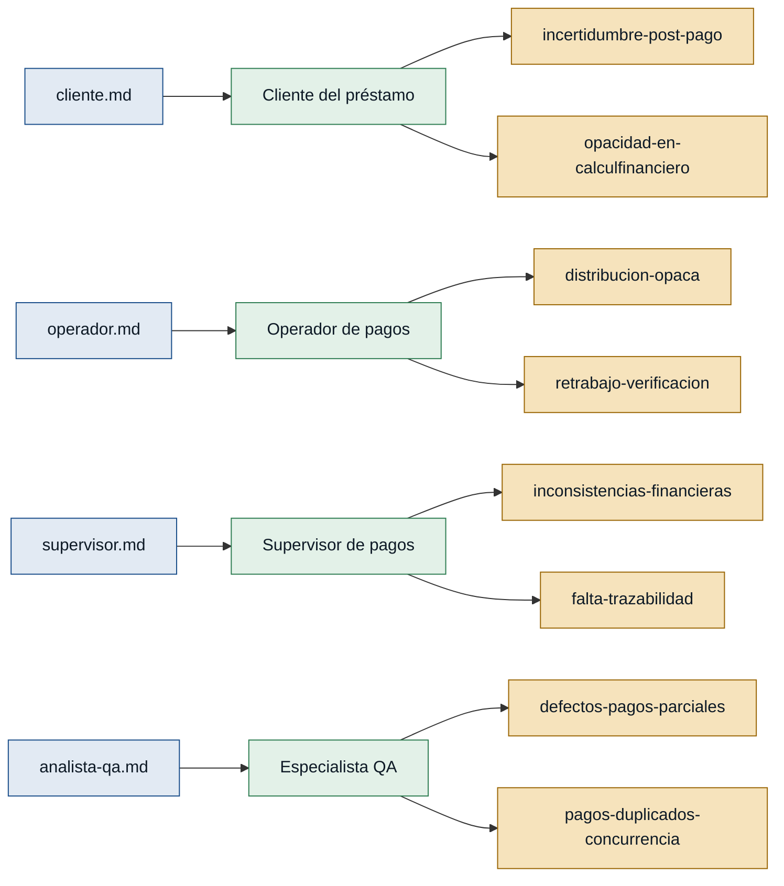

# Personas y stakeholders — fondo-cesantia

> Evidencia extraída de las entrevistas en `discoveries/fondo-cesantia/interviews/`.
> Conteo: **4 personas** (3 de primera mano + 1 con respaldo mixto) y
> **3 stakeholders** (3 de primera mano en su rol de gestión/supervisión/calidad).

Convención de color:
- Respaldo **primera mano** = entrevista propia del rol.
- Respaldo **referenciada** = solo aparece mencionada por otros.

## Mapa de trazabilidad (entrevistas → personas → dolores)

## Personas

### Cliente del préstamo — persona que paga su préstamo
- **Contexto:** persona que tiene un préstamo vigente con el fondo y realiza pagos periódicos (totales, parciales o excedentes) por distintos canales.
- **Objetivo principal:** saber de inmediato cuánto pagó, qué cuotas quedaron cubiertas y cuál es su saldo pendiente, con evidencia verificable.
- **Dolores:**
  - Incertidumbre tras pagar: no siempre entiende cómo los pagos parciales afectan la deuda total, ni qué pasa con el dinero cuando paga más que una cuota (cliente.md).
  - Falta de comprobante claro y demora en la actualización del estado, que le hace temer que el pago no quedó registrado (cliente.md).
  - Cálculos financieros difíciles de entender para quien no trabaja a diario con ellos (cliente.md).
- **Respaldo:** **primera mano** (entrevista propia `cliente.md`).

### Operador de pagos — quien registra el pago en el sistema
- **Contexto:** persona de front-office que identifica el préstamo, captura el monto pagado por el cliente y revisa cómo el sistema lo distribuye.
- **Objetivo principal:** registrar el pago de forma correcta y verificar rápidamente cómo se aplicó, sin tener que reconstruir manualmente la distribución.
- **Dolores:**
  - Distribución opaca: el sistema aplica el monto pero no muestra con claridad qué cuotas afectó ni por qué (operador.md).
  - Retrabajo por verificación: siempre debe revisar el resultado porque los pagos parciales y excedentes generan dudas sobre si la distribución fue correcta (operador.md).
  - Cuando el estado mostrado no coincide con lo esperado, debe revisar el historial completo del préstamo para entender qué pasó (operador.md).
- **Respaldo:** **primera mano** (entrevista propia `operador.md`).

### Supervisor de pagos — quien valida y corrige inconsistencias
- **Contexto:** responsable de que los pagos se registren correctamente y de mantener la consistencia financiera de los préstamos; revisa indicadores y atiende casos excepcionales.
- **Objetivo principal:** detectar y corregir diferencias (pagos parciales, excedentes, movimientos atípicos) antes de que se propaguen a reportes y contabilidad.
- **Dolores:**
  - Inconsistencias que se propagan: un error temprano en la aplicación de un pago puede afectar saldos, cuotas e historiales posteriores (supervisor.md).
  - Falta de trazabilidad para reconstruir operaciones mucho tiempo después de ocurridas (supervisor.md).
  - Reglas de negocio "que parecen simples hasta que aparecen escenarios excepcionales" (pagos parciales, excedentes, refinanciamientos) y que no siempre están documentadas (supervisor.md).
- **Respaldo:** **primera mano** (entrevista propia `supervisor.md`).

### Especialista QA — quien prueba el módulo de pagos
- **Contexto:** validador del módulo de aplicación de pagos; conoce los escenarios donde históricamente se han colado defectos.
- **Objetivo principal:** asegurar que toda nueva versión del módulo pase los escenarios críticos (pago exacto, parcial, excedente, saldo a favor, reverso, varias cuotas vencidas, préstamo cancelado).
- **Dolores:**
  - Defectos recurrentes en pagos parciales: la cuota cambia de estado cuando no debería o el saldo pendiente desaparece (analista-qa.md).
  - Pagos duplicados por falta de controles de concurrencia (operador que hace doble clic, dos usuarios sobre el mismo préstamo) (analista-qa.md).
  - Reglas no documentadas (mora, refinanciamientos, reestructuraciones, acuerdos particulares) que aparecen tarde y generan incidentes (analista-qa.md).
- **Respaldo:** **primera mano** (entrevista propia `analista-qa.md`, rol `especialista QA`).
  - Nota: su rol es de **calidad**, no de usuario final del producto; se incluye como persona porque tiene poder de veto sobre la liberación de cambios del módulo.

## Stakeholders

### Coordinador de proyectos
- **Interés en el sistema:** garantizar que el proceso de aplicación de pagos mantenga la consistencia de cartera, cobranza, contabilidad y reportes financieros; cualquier cambio requiere evaluación cuidadosa de impacto. Le preocupa especialmente que un pago no se refleje correctamente o que el saldo pendiente no coincida con los comprobantes, porque eso dispara reclamos.
- **Fuente:** `coordinador-proyectos.md`.

### Supervisor (también persona, ya listado arriba)
- **Interés adicional como stakeholder:** mantener la trazabilidad y consistencia de la información financiera a lo largo del tiempo; reconstruir cualquier operación incluso meses después.
- **Fuente:** `supervisor.md`.

### Especialista QA (también persona, ya listado arriba)
- **Interés adicional como stakeholder:** que toda liberación valide pagos exactos, parciales, excedentes, saldo a favor, reversos, múltiples cuotas vencidas y préstamos cancelados; documentar reglas que actualmente están solo en la cabeza de los operativos.
- **Fuente:** `analista-qa.md`.
